# CSV数据流程图

## 概述
本文档详细描述了Stock-TSDB系统中CSV数据的导入导出流程，涵盖从文件读取到存储引擎写入的完整数据流。

## 整体架构图

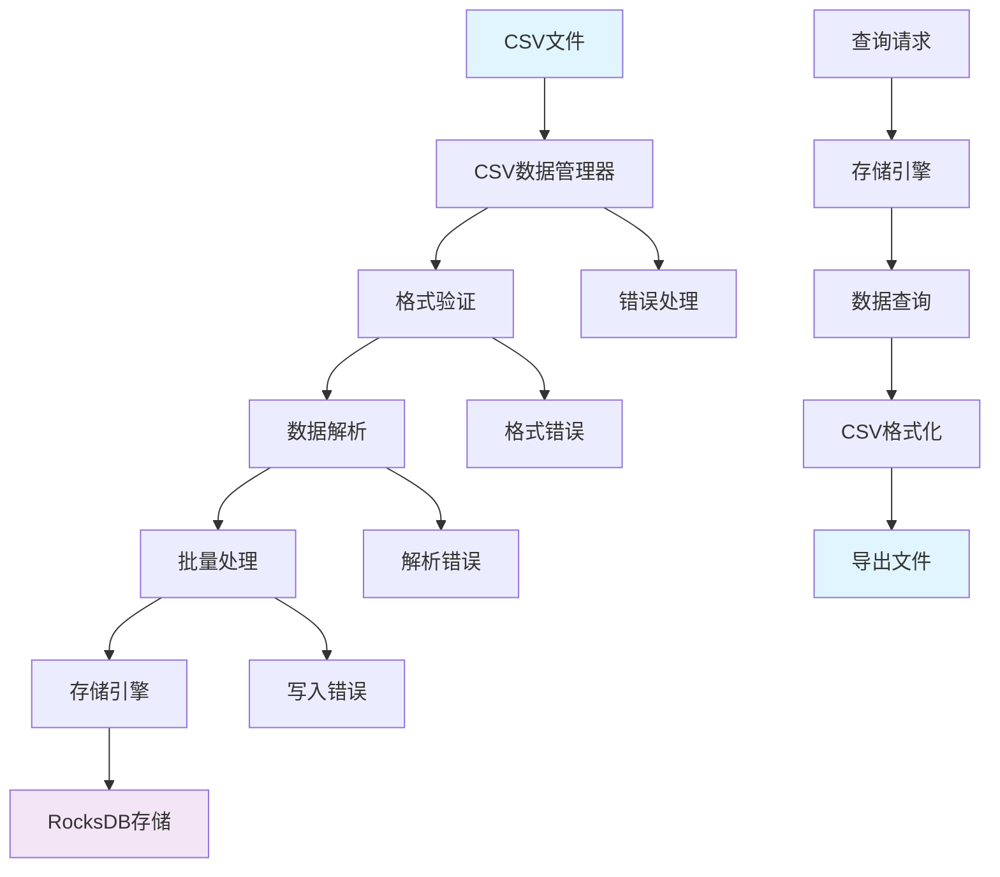

## 详细数据流程图

### 1. CSV导入流程

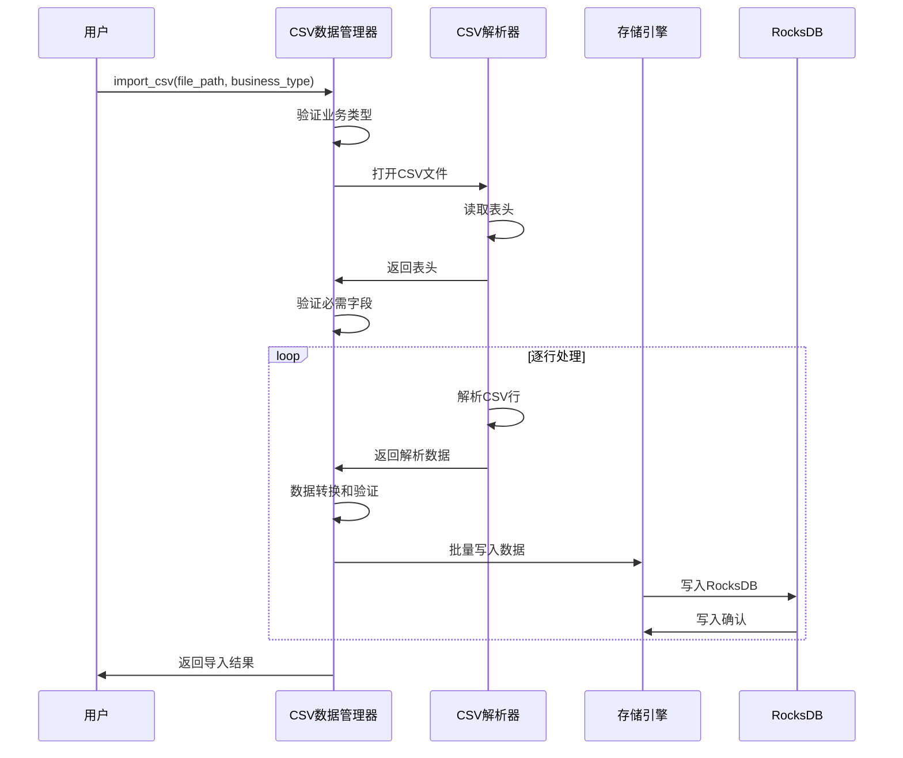

### 2. CSV导出流程

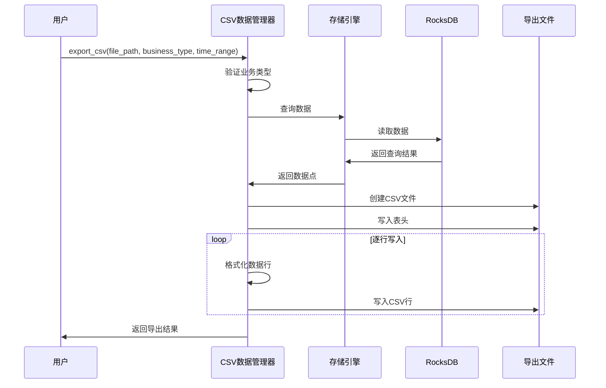

## 核心组件交互图

### CSV数据管理器架构

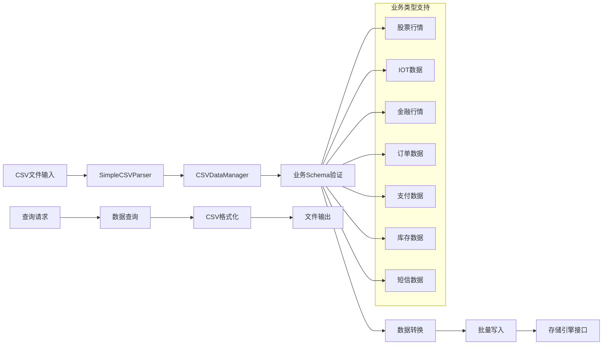

## 数据处理状态图

### CSV导入状态流转

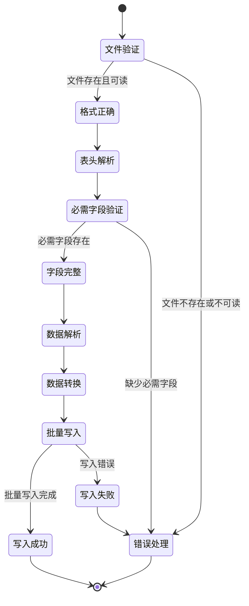

### CSV导出状态流转

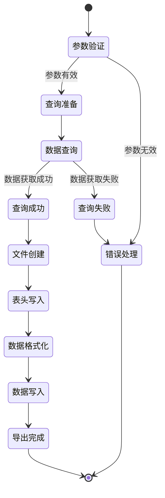

## 业务数据Schema图

### 支持的CSV格式类型

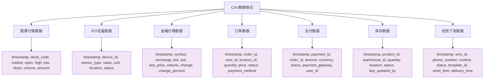

## 错误处理流程图

### CSV导入错误处理

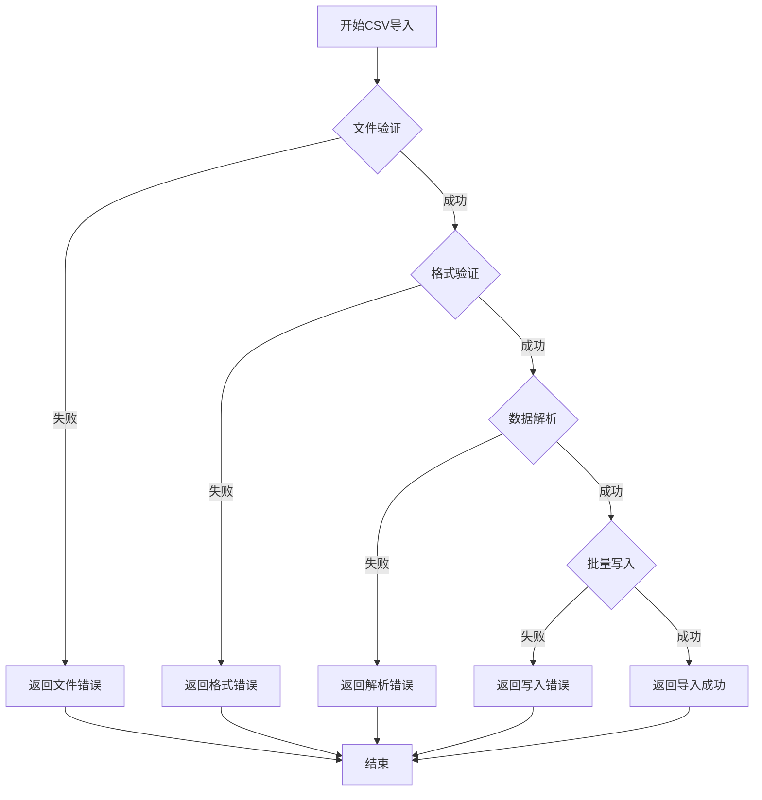

### CSV导出错误处理

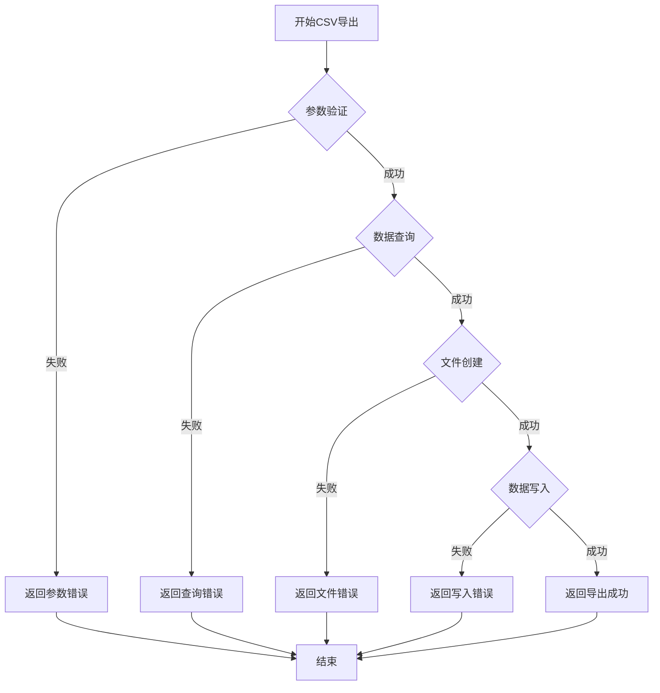

## 性能优化流程图

### 批量处理优化

### 缓存策略

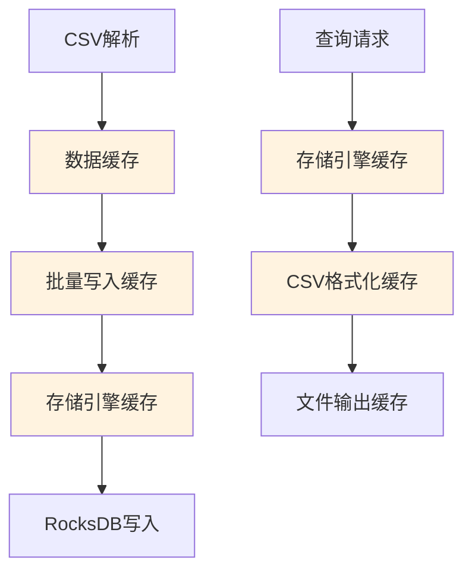

## 实际使用示例

### 股票数据导入流程

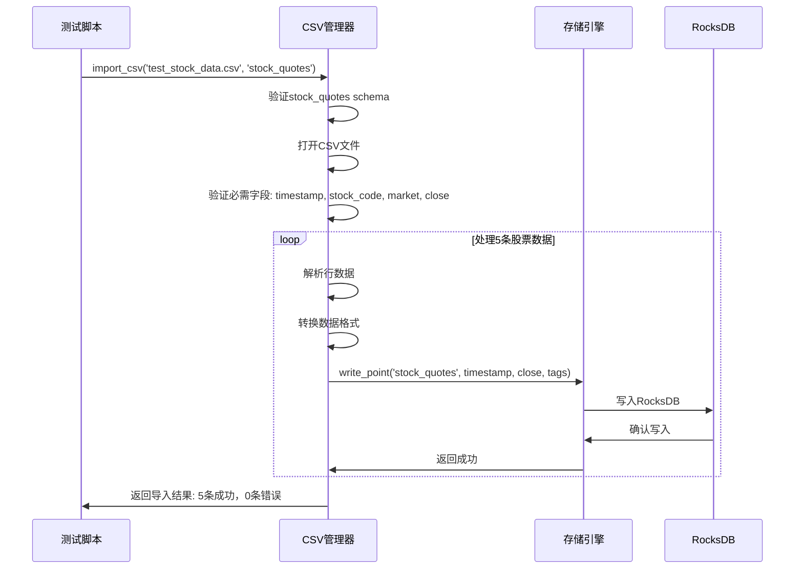

### IOT数据导出流程

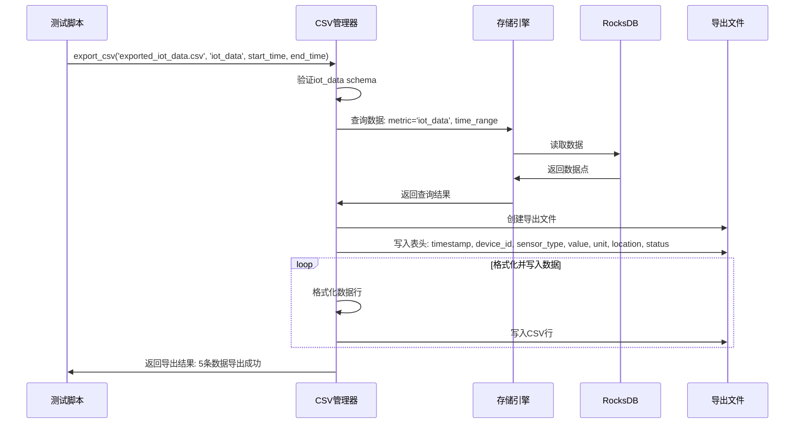

## 总结

CSV数据流程图展示了Stock-TSDB系统中完整的数据导入导出机制，包括：

1. **多业务类型支持** - 7种不同的业务数据格式
2. **完整的验证流程** - 文件、格式、数据三层验证
3. **批量处理优化** - 提升导入导出性能
4. **错误处理机制** - 完善的错误检测和恢复
5. **缓存策略** - 多级缓存提升性能

该流程图为开发和运维人员提供了清晰的CSV数据处理参考，确保数据处理的可靠性和高效性。