# CSV业务数据写入时的RowKey编码机制

## 概述
本文档详细描述了Stock-TSDB系统中CSV业务数据写入时的RowKey编码机制，包括多种编码方案、前缀压缩策略、性能优化和实际应用场景。

## RowKey编码架构图

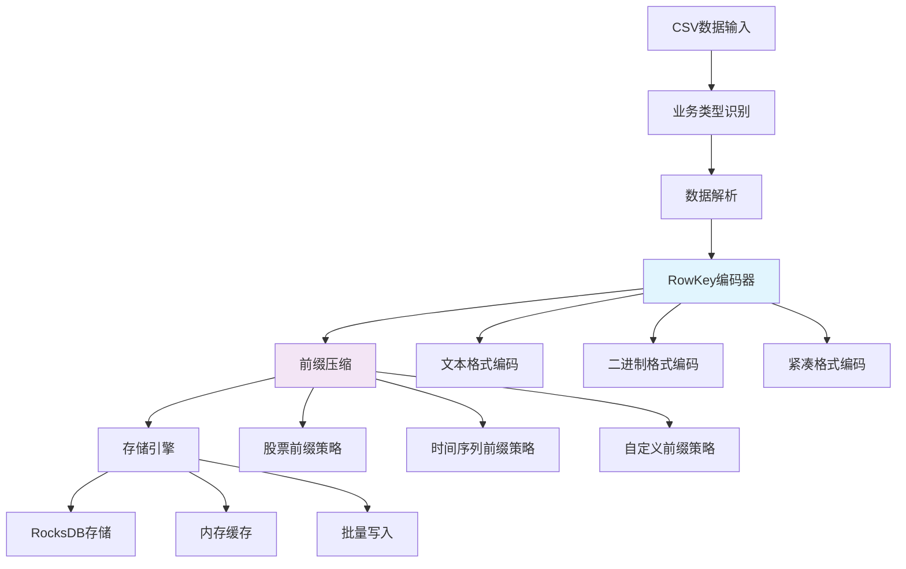

## 核心编码方案

### 1. 文本格式编码（默认方案）

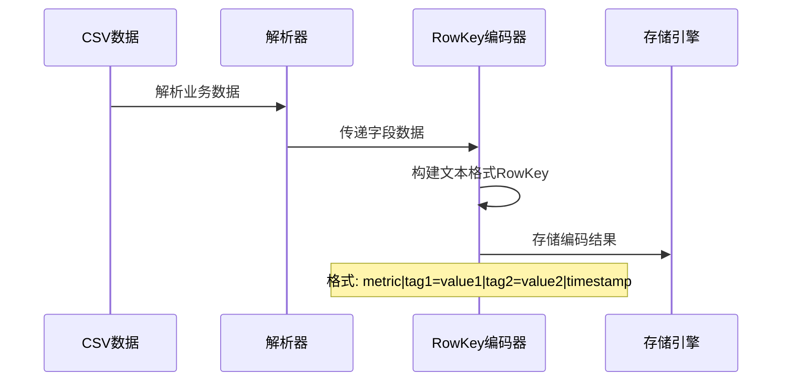

**编码规则：**
- **格式**: `metric|tag1=value1|tag2=value2|timestamp`
- **分隔符**: 使用 `|` 分隔不同字段
- **标签格式**: `key=value` 键值对
- **时间戳**: Unix时间戳（秒级精度）

**示例：**
```lua
-- 股票数据RowKey
"stock|SH|000001|1633046400"

-- IOT设备数据RowKey  
"iot_data|device_id=sensor001|sensor_type=temperature|1633046400"
```

### 2. 二进制格式编码（高性能方案）

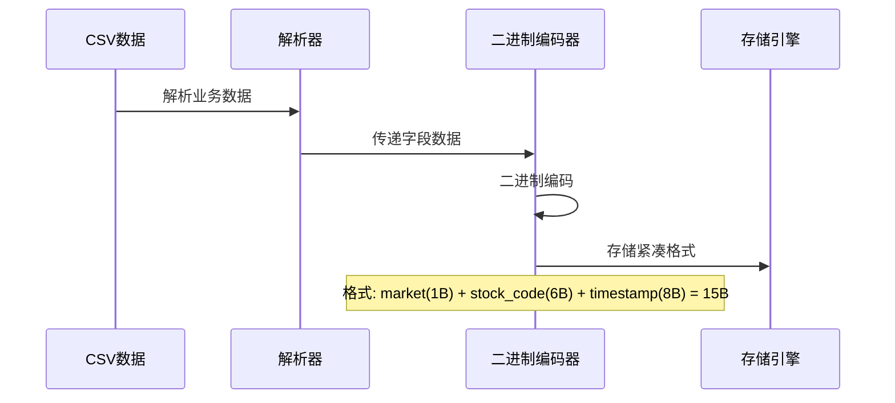

**编码规则：**
- **固定长度**: 15字节固定长度RowKey
- **市场代码**: 1字节（SH=0x01, SZ=0x02等）
- **股票代码**: 6字节（固定长度，不足补空格）
- **时间戳**: 8字节（Unix时间戳，秒级精度）

**示例：**
```lua
-- 股票数据二进制RowKey（15字节）
-- 市场: SH(0x01) + 代码: 000001 + 时间戳: 1633046400
"\x01000001\x00\x00\x00\x00\x61\x5E\xE8\x80"
```

### 3. 紧凑格式编码（micro_ts插件）

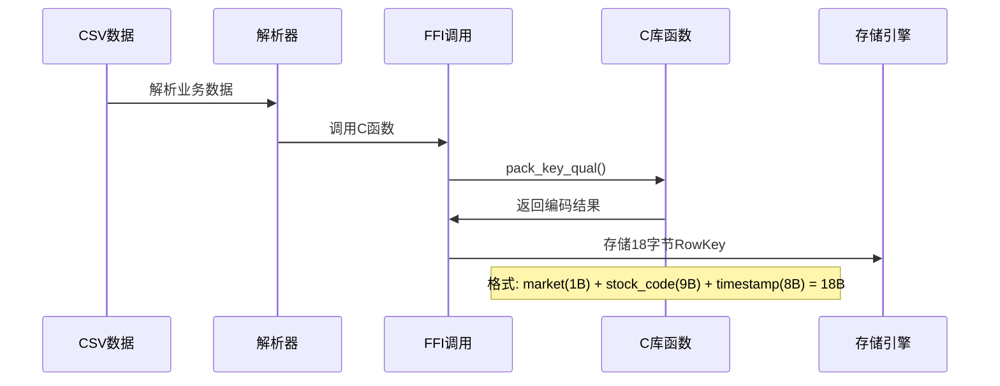

**编码规则：**
- **固定长度**: 18字节固定长度RowKey
- **市场代码**: 1字节
- **股票代码**: 9字节（支持更长的代码）
- **时间戳**: 8字节（毫秒级精度）
- **Qualifier**: 6字节（微秒偏移和序列号）

## 前缀压缩机制

### 前缀压缩策略配置

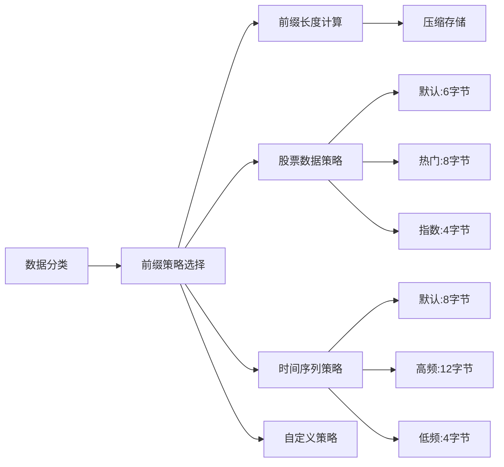

### 前缀压缩配置表

| 数据类型 | 策略名称 | 前缀长度 | 描述 |
|---------|---------|----------|------|
| 股票数据 | default | 6字节 | 默认股票前缀策略 |
| 股票数据 | hot_stock | 8字节 | 热门股票前缀策略 |
| 股票数据 | index_stock | 4字节 | 指数股票前缀策略 |
| 时间序列 | default | 8字节 | 默认时间序列前缀策略 |
| 时间序列 | high_frequency | 12字节 | 高频数据前缀策略 |
| 时间序列 | low_frequency | 4字节 | 低频数据前缀策略 |

### ColumnFamily前缀映射

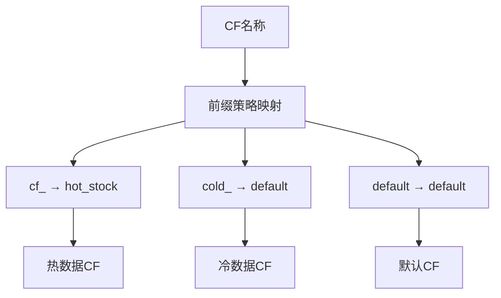

## 业务数据编码详细流程

### CSV导入时的RowKey编码流程

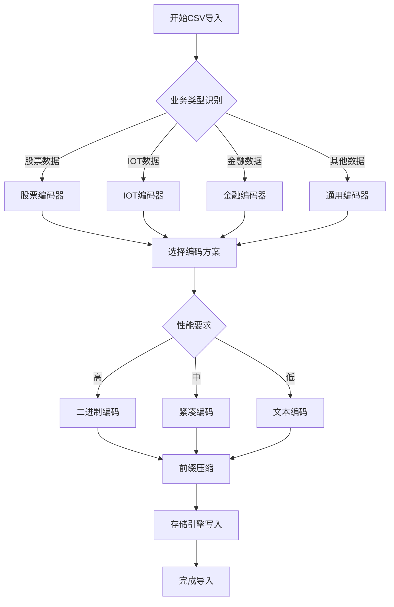

### 股票数据编码详细过程

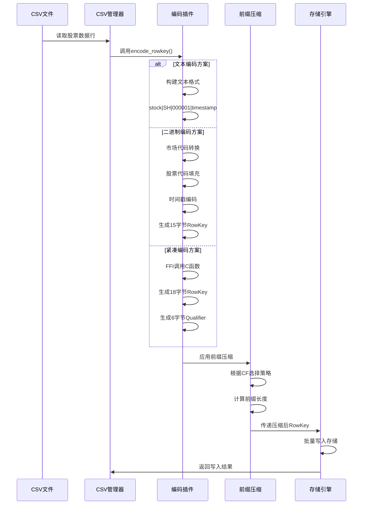

## 性能优化机制

### 缓存策略

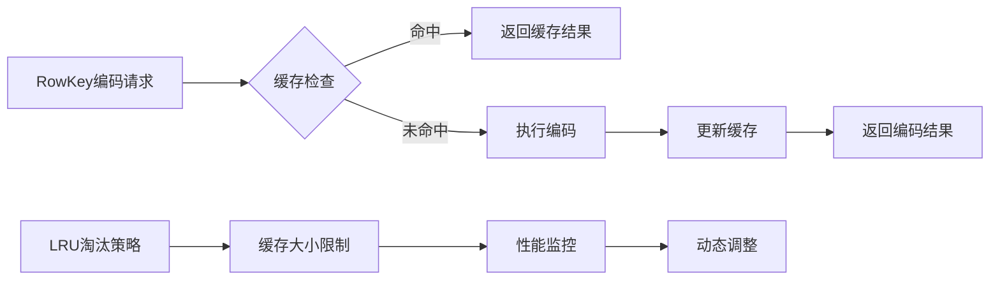

### 批量处理优化

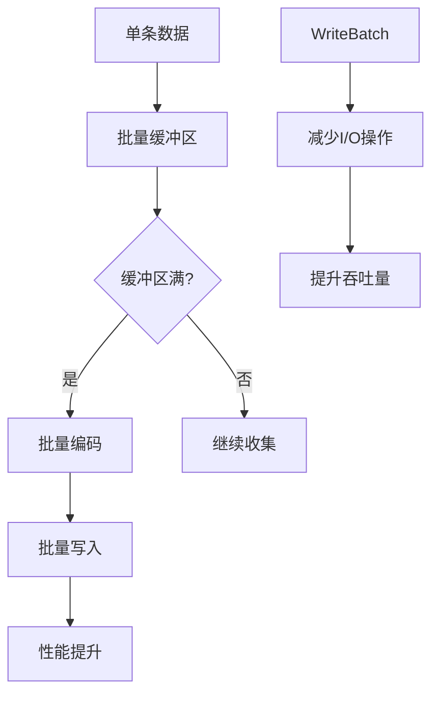

## 实际编码示例

### 股票数据编码示例

```lua
-- CSV数据: timestamp,stock_code,market,open,high,low,close,volume,amount
-- 输入: 1633046400,000001,SH,10.5,11.2,10.3,10.8,1000000,10800000

-- 文本编码结果
rowkey = "stock|SH|000001|1633046400"
qualifier = "00000000"

-- 二进制编码结果（15字节）
rowkey = "\x01000001\x00\x00\x00\x00\x61\x5E\xE8\x80"  -- SH市场 + 000001 + 时间戳
qualifier = "00000000"

-- 紧凑编码结果（18字节 + 6字节qualifier）
rowkey = "\x010000001  \x00\x00\x00\x00\x17\x6F\x35\x80"  -- 扩展的9字节代码
qualifier = "\x00\x00\x00\x00\x00\x00"  -- 微秒偏移和序列号
```

### IOT数据编码示例

```lua
-- CSV数据: timestamp,device_id,sensor_type,value,unit,location,status
-- 输入: 1633046400,sensor001,temperature,25.5,C,room1,normal

-- 文本编码结果
rowkey = "iot_data|device_id=sensor001|sensor_type=temperature|1633046400"
qualifier = "00000000"

-- 二进制编码结果
rowkey = "iot\x00sensor001temp\x00\x00\x00\x00\x61\x5E\xE8\x80"
qualifier = "00000000"
```

## 编码性能对比

### 不同编码方案性能指标

| 编码方案 | RowKey大小 | 编码速度 | 存储效率 | 适用场景 |
|---------|------------|----------|----------|----------|
| 文本编码 | 可变长度 | 中等 | 低 | 调试、兼容性 |
| 二进制编码 | 15字节固定 | 高 | 高 | 高性能存储 |
| 紧凑编码 | 18字节固定 | 最高 | 最高 | 极致性能 |

### 前缀压缩效果

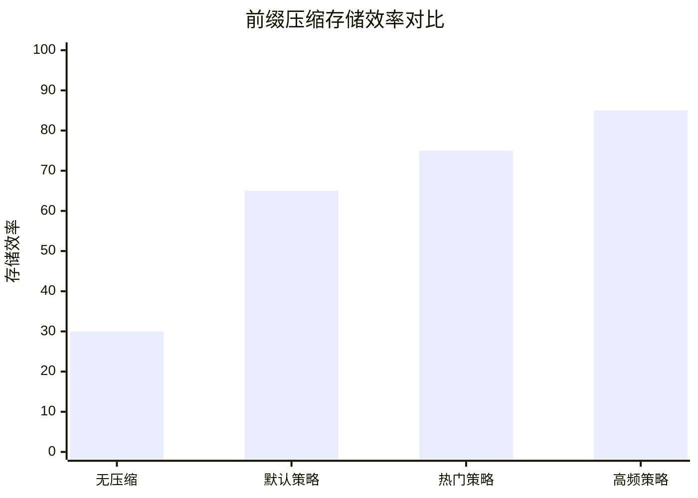

## 配置和调优

### 编码方案选择配置

```lua
-- 在存储引擎配置中设置编码方案
local config = {
    rowkey_encoding = {
        -- 默认编码方案
        default_scheme = "text",  -- text, binary, compact
        
        -- 业务特定编码方案
        business_specific = {
            stock_quotes = "compact",      -- 股票使用紧凑编码
            iot_data = "binary",           -- IOT使用二进制编码
            financial_quotes = "binary",   -- 金融数据使用二进制编码
            orders = "text",               -- 订单数据使用文本编码（便于调试）
            payments = "text"              -- 支付数据使用文本编码
        },
        
        -- 性能优化配置
        performance = {
            enable_cache = true,           -- 启用编码缓存
            cache_size = 1000,             -- 缓存大小
            batch_encoding = true,         -- 批量编码
            prefetch_strategy = "adaptive" -- 自适应预取策略
        }
    }
}
```

### 前缀压缩配置

```lua
-- 前缀压缩配置示例
local prefix_config = {
    -- 股票数据前缀策略
    stock_strategies = {
        default = { prefix_length = 6, description = "默认股票前缀" },
        hot_stock = { prefix_length = 8, description = "热门股票前缀" },
        index_stock = { prefix_length = 4, description = "指数股票前缀" }
    },
    
    -- CF映射关系
    cf_mapping = {
        ["cf_"] = "hot_stock",      -- 热数据CF
        ["cold_"] = "default",       -- 冷数据CF  
        ["default"] = "default"     -- 默认CF
    },
    
    -- 动态调整配置
    adaptive = {
        enable_dynamic_adjustment = true,  -- 启用动态调整
        adjustment_interval = 3600,       -- 调整间隔（秒）
        performance_threshold = 0.8       -- 性能阈值
    }
}
```

## 总结

CSV业务数据写入时的RowKey编码机制提供了多种灵活的编码方案：

1. **多编码方案支持** - 文本、二进制、紧凑三种编码方案
2. **智能前缀压缩** - 根据数据类型和CF动态选择压缩策略
3. **性能优化机制** - 缓存、批量处理、预取等多重优化
4. **业务适配性** - 不同业务数据使用最优编码方案
5. **可配置性** - 灵活的配置选项满足不同场景需求

这套编码机制确保了CSV数据导入的高效性和存储的空间效率，是Stock-TSDB系统高性能的重要保障。