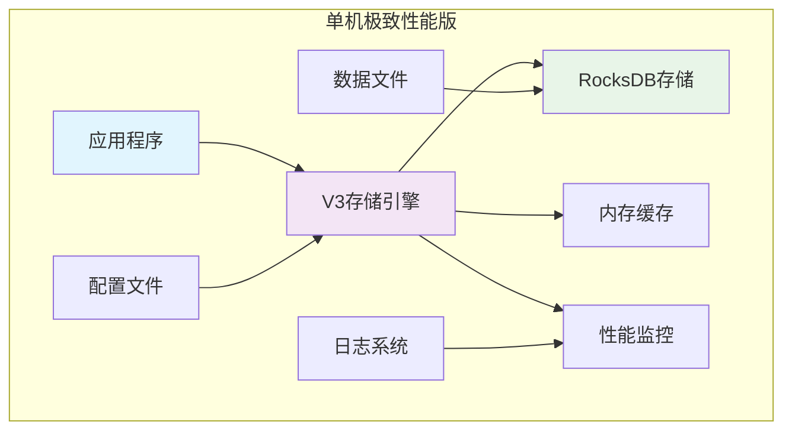
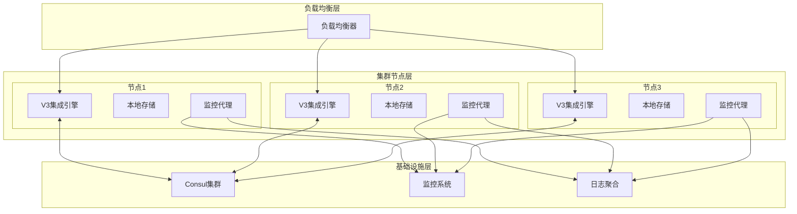

# 简化部署架构 - 两套系统整合方案

## 概述

为满足业务与性能优化需求，将当前多套系统整合为两套核心系统：
- **单机极致性能版**：追求最高性能的单机部署
- **集群可扩展版**：支持水平扩展的集群部署

## 1. 单机极致性能版

### 1.1 架构设计



### 1.2 核心特性
- **极致性能优化**：LuaJIT编译优化、内存池管理
- **高性能存储**：RocksDB深度优化、批量写入
- **智能缓存**：多级缓存策略、LRU淘汰机制
- **轻量级监控**：实时性能指标、资源使用监控

### 1.3 配置示例
```lua
-- 单机版配置文件: config/standalone_performance.lua
return {
    -- 存储配置
    storage = {
        engine = "v3_rocksdb",
        data_dir = "./data/standalone",
        block_size = 30,  -- 30秒定长块
        enable_compression = true,
        compression_type = "lz4"
    },
    
    -- 性能优化配置
    performance = {
        enable_luajit_optimization = true,
        memory_pool_size = "1GB",
        write_buffer_size = "64MB",
        batch_size = 1000
    },
    
    -- 缓存配置
    cache = {
        enabled = true,
        max_size = "512MB",
        ttl = 300  -- 5分钟
    },
    
    -- 监控配置
    monitoring = {
        enabled = true,
        metrics_port = 9090,
        health_check_interval = 30
    }
}
```

## 2. 集群可扩展版

### 2.1 架构设计



### 2.2 核心特性
- **水平扩展**：支持动态添加/移除节点
- **数据分片**：自动数据分片和负载均衡
- **高可用性**：故障自动检测和恢复
- **服务发现**：Consul集成服务注册发现

### 2.3 配置示例
```lua
-- 集群版配置文件: config/cluster_scalable.lua
return {
    -- 集群配置
    cluster = {
        enabled = true,
        mode = "distributed",
        node_id = "node-1",
        
        -- 服务发现
        service_discovery = {
            provider = "consul",
            servers = {"127.0.0.1:8500"},
            health_check_interval = 30
        },
        
        -- 数据分片
        sharding = {
            enabled = true,
            strategy = "consistent_hashing",
            virtual_nodes = 1000
        }
    },
    
    -- 存储配置
    storage = {
        engine = "v3_integrated",
        data_dir = "./data/cluster",
        replication_factor = 2
    },
    
    -- 网络配置
    network = {
        bind_address = "0.0.0.0",
        port = 6379,
        max_connections = 10000
    },
    
    -- 监控配置
    monitoring = {
        enabled = true,
        prometheus_port = 9090,
        metrics_path = "/metrics"
    }
}
```

## 3. 系统选择指南

### 3.1 选择单机版的场景
- 数据量在TB级别以下
- 追求极致读写性能
- 部署环境资源有限
- 不需要高可用性要求
- 开发和测试环境

### 3.2 选择集群版的场景
- 数据量超过TB级别
- 需要水平扩展能力
- 高可用性要求严格
- 生产环境部署
- 多地域部署需求

### 3.3 性能对比

| 指标 | 单机版 | 集群版 |
|------|--------|--------|
| 写入性能 | 50-80万点/秒 | 30-50万点/秒（单节点）|
| 查询性能 | 20-40万点/秒 | 15-30万点/秒（单节点）|
| 扩展性 | 垂直扩展 | 水平扩展 |
| 可用性 | 单点故障 | 高可用 |
| 部署复杂度 | 简单 | 中等 |

## 4. 统一的安装部署机制

### 4.1 安装脚本结构
```
scripts/
├── install.sh                    # 主安装脚本
├── deploy_standalone.sh          # 单机版部署
├── deploy_cluster.sh            # 集群版部署
├── config/
│   ├── standalone_template.conf # 单机版配置模板
│   └── cluster_template.conf    # 集群版配置模板
└── utils/
    ├── health_check.sh          # 健康检查
    └── backup_restore.sh        # 备份恢复
```

### 4.2 一键安装命令
```bash
# 单机版安装
./scripts/deploy_standalone.sh --config config/standalone_performance.lua

# 集群版安装  
./scripts/deploy_cluster.sh --config config/cluster_scalable.lua --nodes 3
```

### 4.3 环境要求
- **操作系统**: Ubuntu 18.04+, CentOS 7+, macOS 10.14+
- **内存**: 单机版≥8GB，集群版≥16GB（推荐）
- **存储**: SSD硬盘，单机版≥100GB，集群版≥500GB
- **网络**: 集群版需要千兆网络

## 5. 简化的使用文档

### 5.1 快速开始指南

#### 单机版快速开始
```bash
# 1. 下载安装
wget https://github.com/your-repo/stock-tsdb/releases/latest/download/stock-tsdb-standalone.tar.gz
tar -xzf stock-tsdb-standalone.tar.gz
cd stock-tsdb-standalone

# 2. 启动服务
./bin/stock-tsdb --config config/standalone_performance.lua

# 3. 验证运行
curl http://localhost:9090/health
```

#### 集群版快速开始
```bash
# 1. 准备Consul集群
docker run -d --name=consul -p 8500:8500 consul:latest

# 2. 启动节点
./scripts/deploy_cluster.sh --nodes 3 --consul 127.0.0.1:8500

# 3. 验证集群
curl http://localhost:8500/v1/health/service/stock-tsdb
```

### 5.2 核心API使用

#### 数据写入
```lua
-- 连接数据库
local tsdb = require "stock_tsdb"
local client = tsdb.connect("127.0.0.1", 6379)

-- 写入股票数据
client:write("stock.SH.000001", {
    timestamp = 1633046400,
    open = 10.5,
    high = 11.2,
    low = 10.3,
    close = 10.8,
    volume = 1000000
})
```

#### 数据查询
```lua
-- 查询时间范围数据
local data = client:query("stock.SH.000001", {
    start_time = 1633046400,
    end_time = 1633132800,
    aggregation = "1h"  -- 1小时聚合
})

-- 批量查询
local batch_data = client:batch_query({
    "stock.SH.000001",
    "stock.SZ.000001",
    "stock.SH.600519"
}, {
    start_time = 1633046400,
    end_time = 1633132800
})
```

## 6. 监控和维护

### 6.1 监控指标
- **性能指标**: QPS、延迟、吞吐量
- **资源使用**: CPU、内存、磁盘、网络
- **业务指标**: 数据点数量、存储大小

### 6.2 维护操作
```bash
# 健康检查
./scripts/utils/health_check.sh

# 备份数据
./scripts/utils/backup_restore.sh --backup --output ./backup.tar.gz

# 恢复数据
./scripts/utils/backup_restore.sh --restore --input ./backup.tar.gz

# 性能调优
./scripts/optimize_performance.sh --config current_config.lua
```

## 7. 故障排除

### 7.1 常见问题

#### 单机版问题
- **内存不足**: 调整memory_pool_size配置
- **磁盘空间不足**: 清理旧数据或扩容存储
- **性能下降**: 检查缓存配置和压缩设置

#### 集群版问题
- **节点失联**: 检查网络连接和Consul服务
- **数据不一致**: 验证数据同步状态
- **负载不均衡**: 调整分片策略和负载均衡配置

### 7.2 日志分析
```bash
# 查看错误日志
tail -f logs/error.log

# 分析性能日志
grep "slow_query" logs/performance.log

# 监控系统日志
tail -f logs/system.log | grep -E "(ERROR|WARN)"
```

## 总结

通过将多套系统整合为两套核心系统，我们实现了：

1. **部署简化**: 从复杂的多套系统简化为清晰的两套选择
2. **性能优化**: 单机版追求极致性能，集群版保证可扩展性
3. **运维便捷**: 统一的安装脚本和监控体系
4. **文档清晰**: 简化的使用指南和故障排除手册

这套方案既满足了不同场景的业务需求，又大大降低了部署和维护的复杂度。