# V3存储引擎架构图与流程图

## 📊 业务流程图

### V3基础版本业务流程图

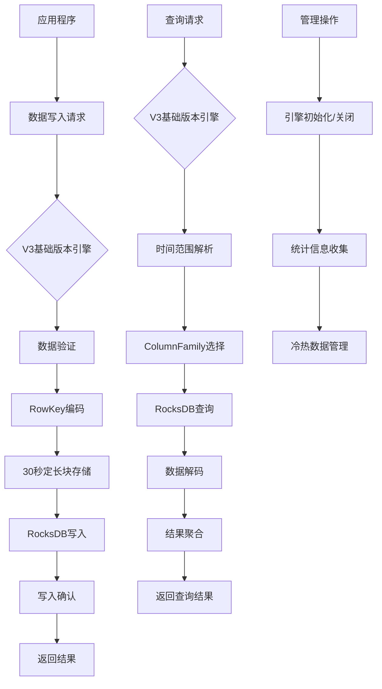

### V3集成版本业务流程图

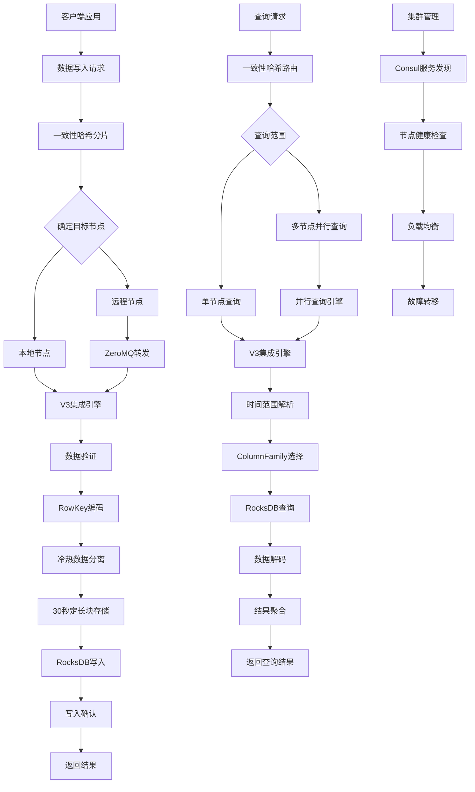

## 🔄 数据流程图

### 数据写入流程

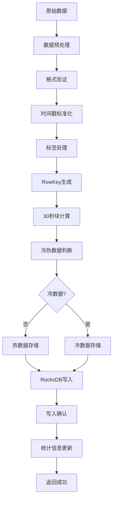

### 数据查询流程

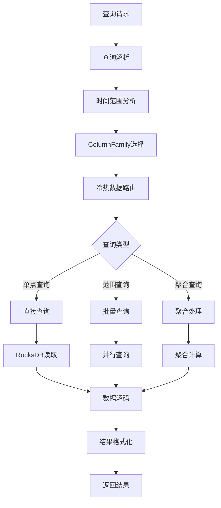

### 集群数据同步流程

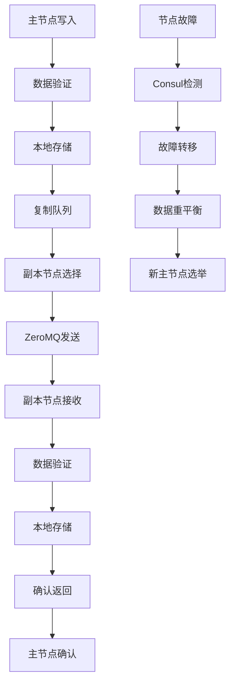

## 🏗️ 系统架构图

### V3基础版本架构

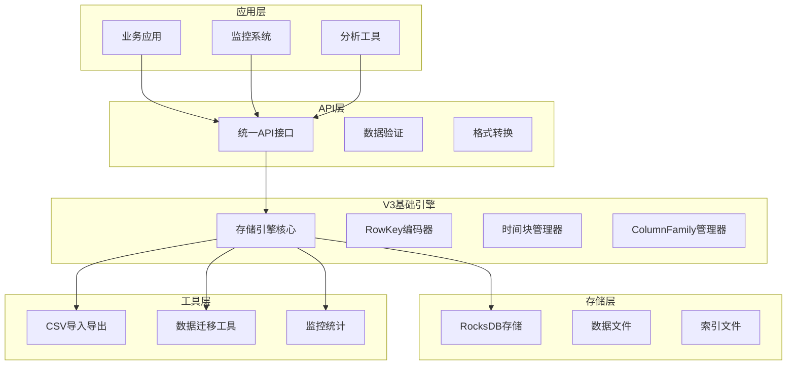

### V3集成版本架构

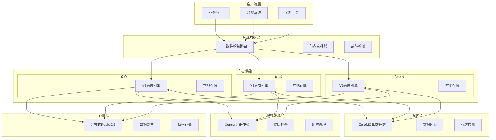

### 插件化架构设计

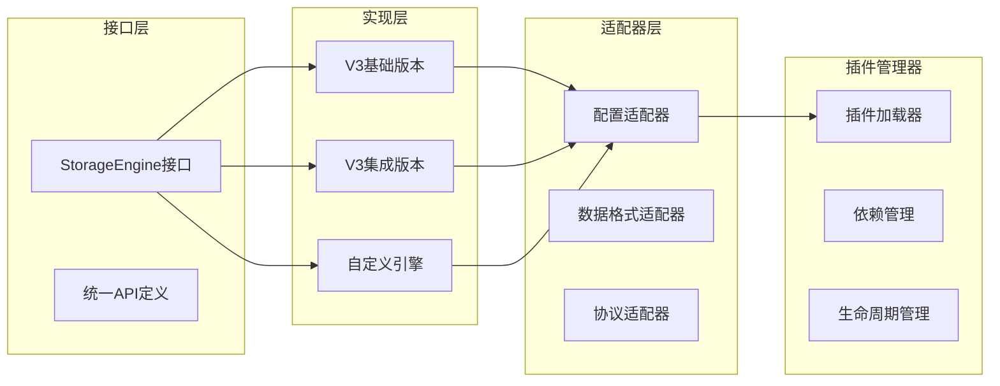

## 🔧 核心组件关系图

### 存储引擎组件关系

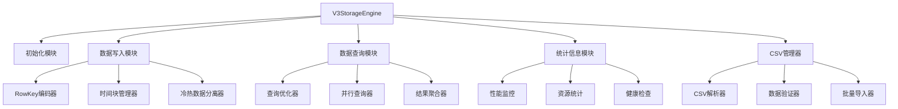

### 集群管理组件关系

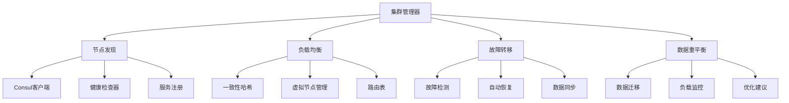

## 📈 性能优化架构

### 写入优化架构

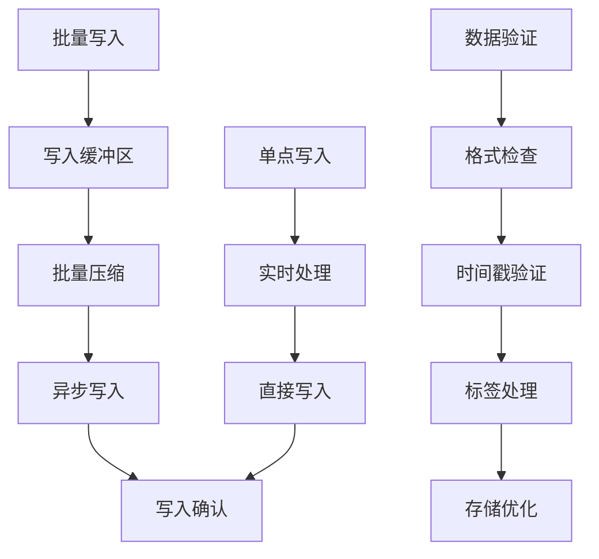

### 查询优化架构

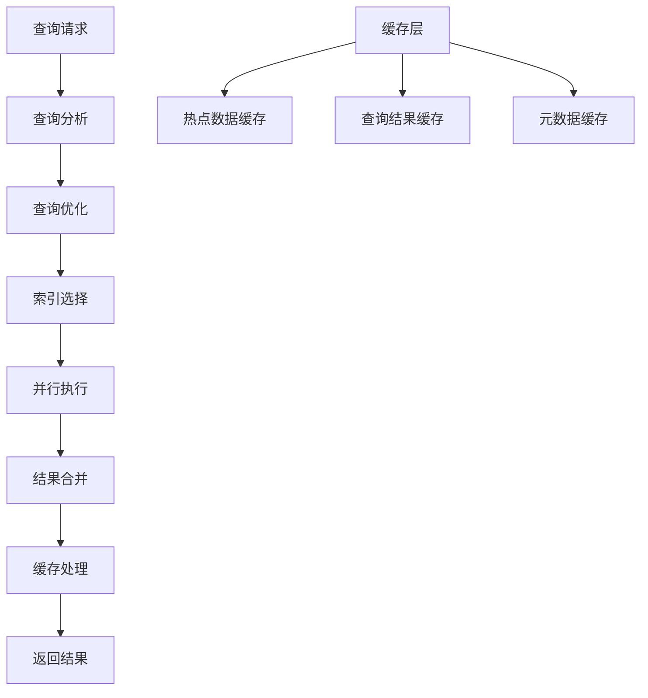

## 🎯 部署架构图

### 单机部署架构

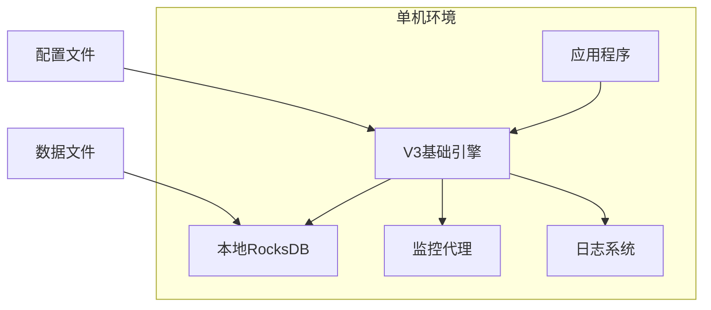

### 集群部署架构

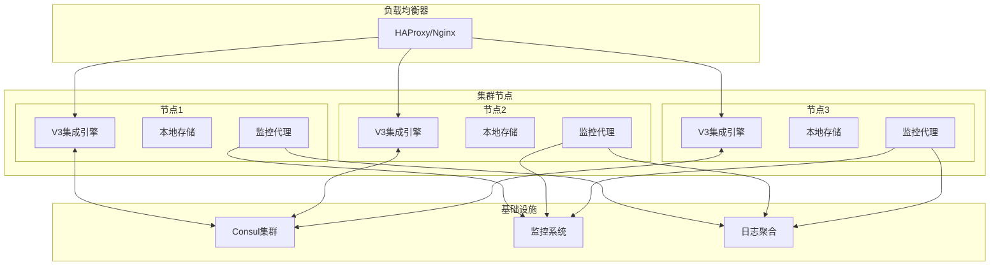

## 📋 总结

### 架构特点

1. **插件化设计**: 支持基础版本和集成版本的统一接口
2. **分层架构**: 清晰的层次划分，便于维护和扩展
3. **分布式支持**: 集成版本提供完整的集群功能
4. **性能优化**: 30秒定长块、冷热数据分离等优化技术
5. **高可用**: 支持故障转移和自动恢复

### 适用场景

- **V3基础版本**: 单机部署、资源受限环境、开发测试
- **V3集成版本**: 大规模分布式、高可用要求、水平扩展需求

### 技术优势

- 统一的API接口设计
- 完善的错误处理机制
- 丰富的监控和统计功能
- 灵活的部署选项
- 优秀的性能表现

这些图表和架构说明为V3存储引擎提供了完整的技术参考，帮助开发者和运维人员更好地理解和使用V3存储引擎。