# V3存储引擎架构可视化

## 🏗️ 整体架构图

### V3存储引擎系统架构

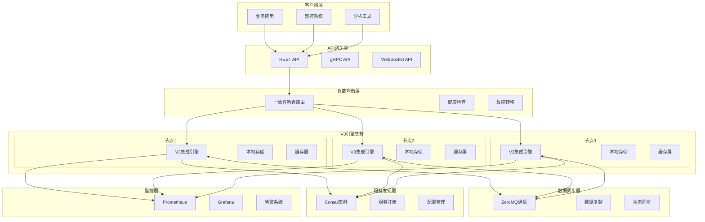

## 🔄 数据流程图

### 数据写入流程

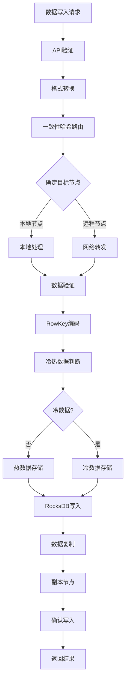

### 数据查询流程

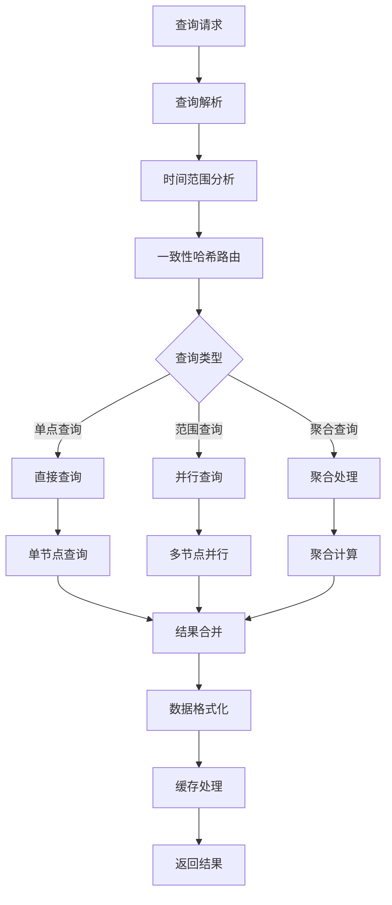

## 🔧 核心组件图

### V3引擎内部架构

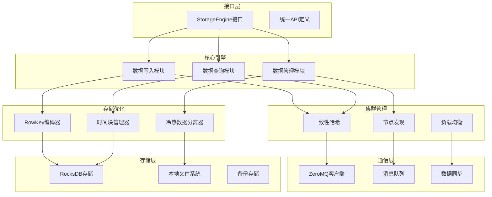

## 📊 性能优化架构

### 写入优化流程

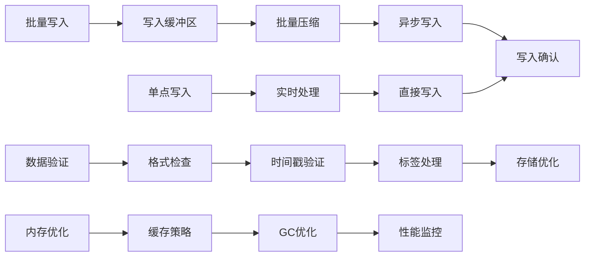

### 查询优化流程

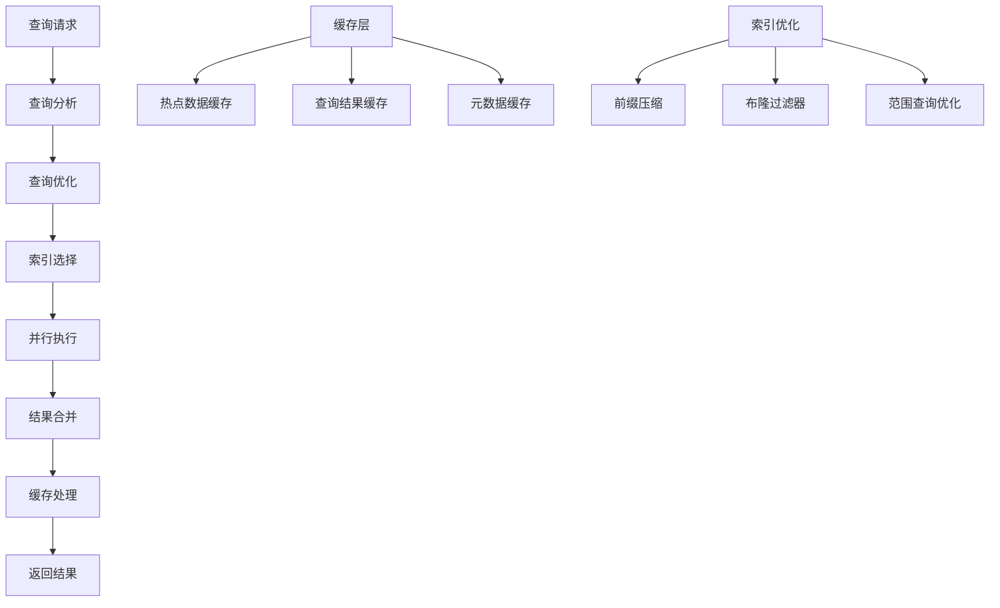

## 🏢 部署架构图

### 单机部署架构

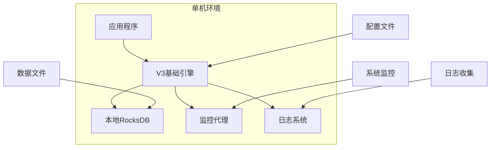

### 集群部署架构

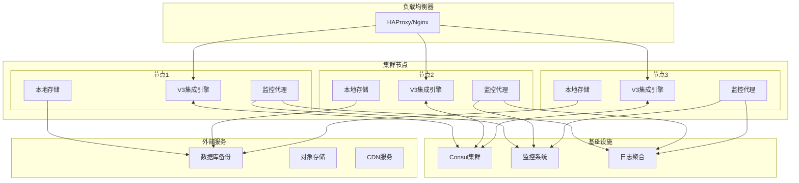

## 🔄 集群通信图

### 节点间通信流程

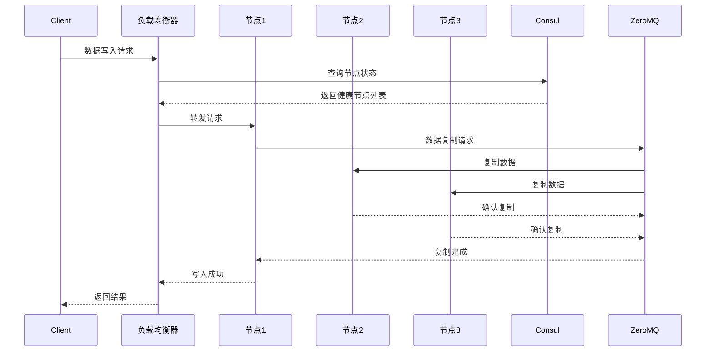

### 故障转移流程

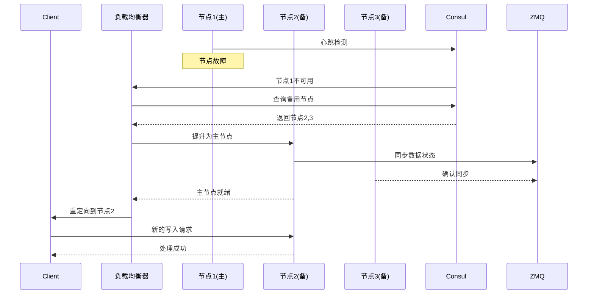

## 📈 监控架构图

### 监控数据流

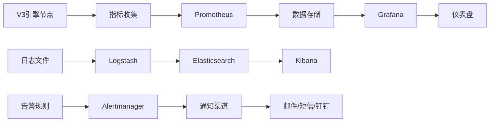

### 关键监控指标

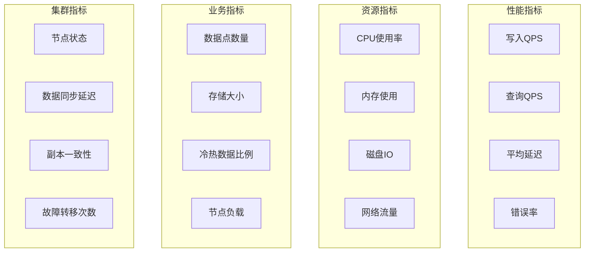

## 🎯 总结

这些可视化图表展示了V3存储引擎的完整架构体系，包括：

1. **整体架构** - 从客户端到存储层的完整数据流
2. **数据流程** - 详细的写入和查询处理流程
3. **核心组件** - 引擎内部模块的组织关系
4. **性能优化** - 各种优化技术的应用流程
5. **部署架构** - 单机和集群部署方案
6. **集群通信** - 节点间交互和故障转移机制
7. **监控体系** - 完整的监控和告警架构

这些图表为理解和使用V3存储引擎提供了直观的参考，帮助开发者和运维人员更好地掌握系统的运行机制。