# V3存储引擎业务流程图与数据流程图

## 📋 业务流程图

### 基础版本业务流程图

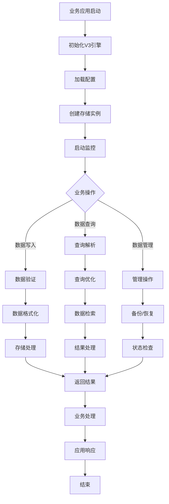

### 集成版本业务流程图

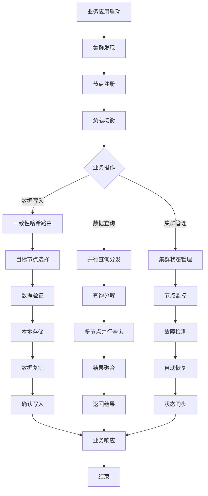

## 🔄 数据流程图

### 数据写入流程

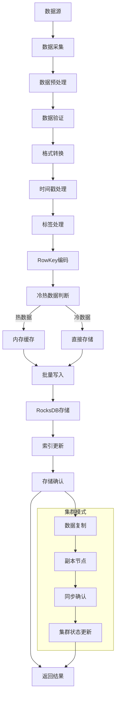

### 数据查询流程

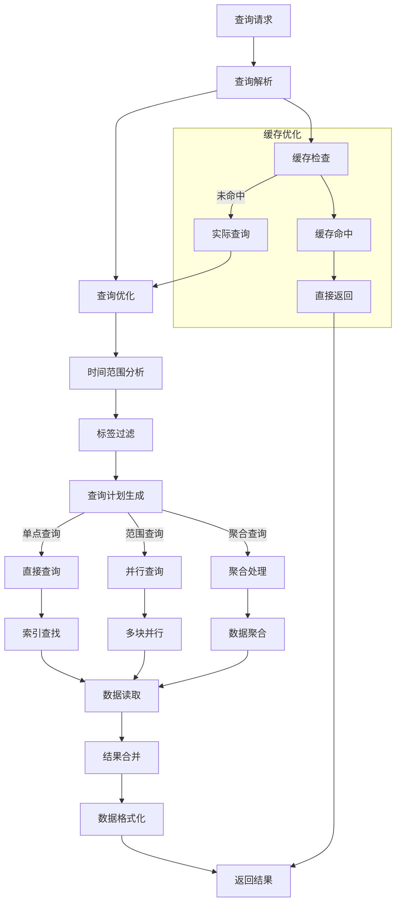

### 数据同步流程

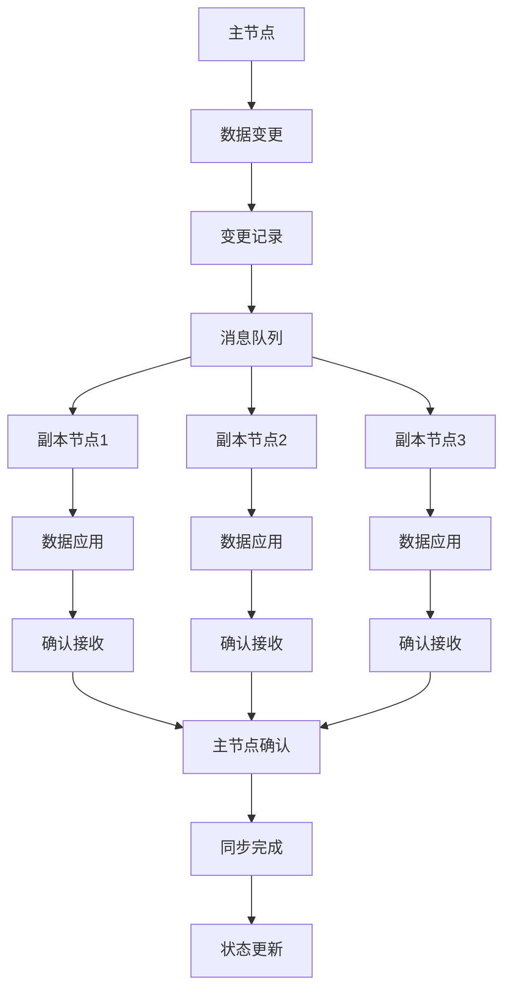

## 🏗️ 系统架构图

### V3引擎整体架构

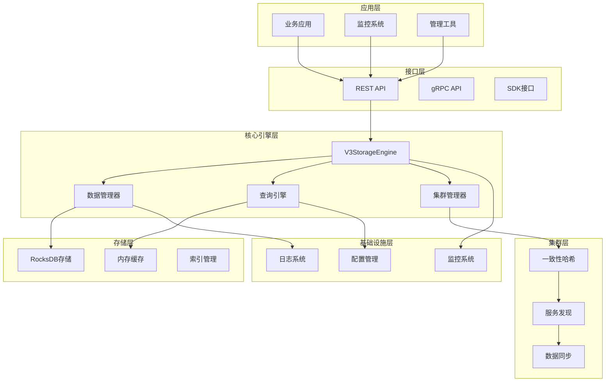

### 插件化架构图

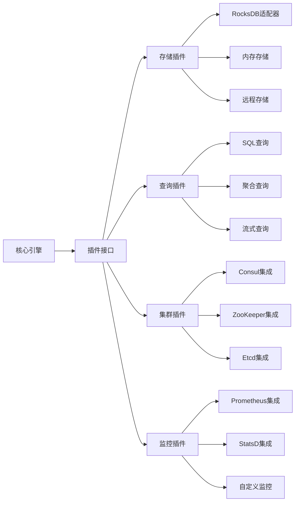

## 📊 性能数据流图

### 写入性能优化流程

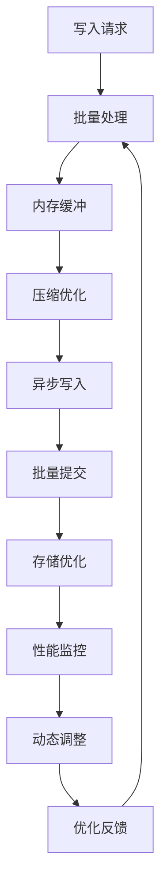

### 查询性能优化流程

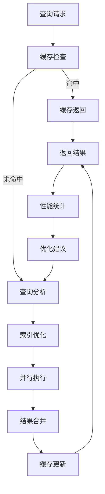

## 🔧 运维流程图

### 集群扩容流程

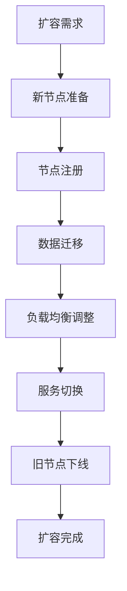

### 故障处理流程

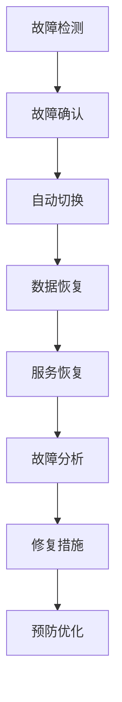

## 🎯 关键业务流程说明

### 1. 数据写入业务流
- **输入**: 时间序列数据点
- **处理**: 验证、格式化、编码、存储
- **输出**: 写入确认结果
- **特性**: 支持批量写入、异步处理、数据压缩

### 2. 数据查询业务流  
- **输入**: 查询条件（时间范围、标签过滤）
- **处理**: 查询解析、优化、执行、结果合并
- **输出**: 查询结果数据
- **特性**: 支持并行查询、缓存优化、聚合计算

### 3. 集群管理业务流
- **输入**: 集群配置、节点状态
- **处理**: 服务发现、负载均衡、故障转移
- **输出**: 集群状态信息
- **特性**: 自动容错、动态扩容、状态同步

### 4. 监控运维业务流
- **输入**: 系统指标、日志数据
- **处理**: 数据收集、分析、告警
- **输出**: 监控报告、告警通知
- **特性**: 实时监控、性能分析、智能告警

## 📈 数据流关键指标

### 写入数据流指标
- 数据采集速率
- 数据验证成功率
- 存储延迟分布
- 批量处理效率

### 查询数据流指标
- 查询响应时间
- 缓存命中率
- 并行查询效率
- 结果合并性能

### 集群数据流指标
- 节点间同步延迟
- 数据一致性状态
- 负载均衡效果
- 故障恢复时间

这些流程图和架构图全面展示了V3存储引擎的业务流程和数据流向，为系统设计、开发和运维提供了清晰的指导。